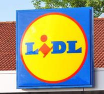
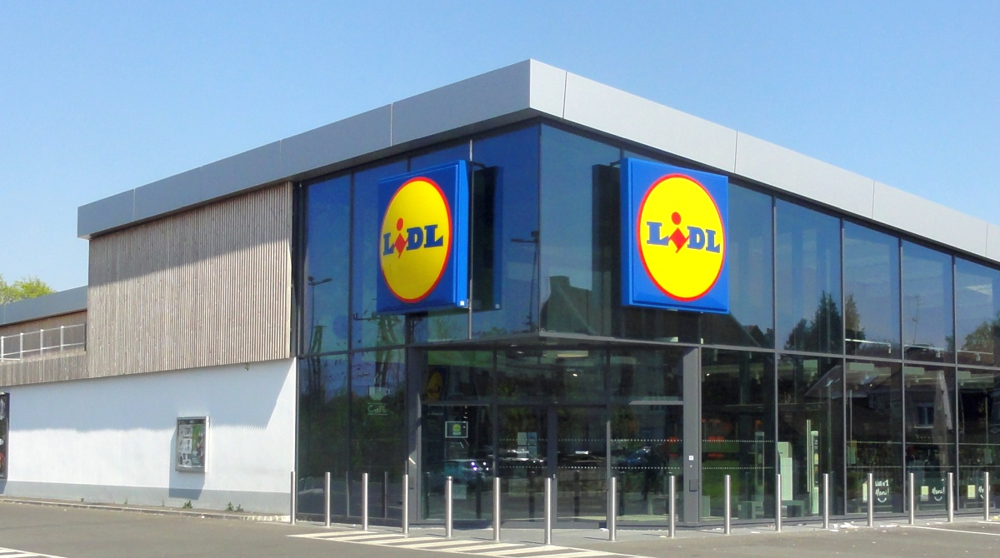
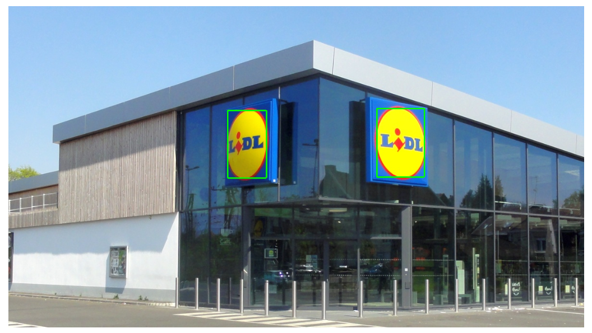

# Przetwarzanie Cyfrowe Obrazów

## Wykrywanie logo Lidla na zdjęciach.

Projekt polegał na zaimplementowaniu i przetestowaniu odpowiednich procedur wstępnego przetworzenia, segmentacji, wyznaczania cech oraz identyfikacji obrazów cyfrowych.
Do rozpoznania wybrałem logo sieci Lidl.

W folderze Original Project znajduje się projekt z zaimplementowanymi
od podstaw algorytmami.

W folderze Project with OpenCV znajduje się program, który odwzorowuje program
oryginalny, ale za pomocą openCV.

Zaimplementowane elementy:
- Filtr uśredniający i unsharp mask.
- Konwersja barw RGB do HSV.
- Filtr erozyjny i dylatacyjny.
- Segmentacja flood fill.
- Momenty geometryczne.

*Przed rozpoznaniem.*

*Po rozpoznaniu.*